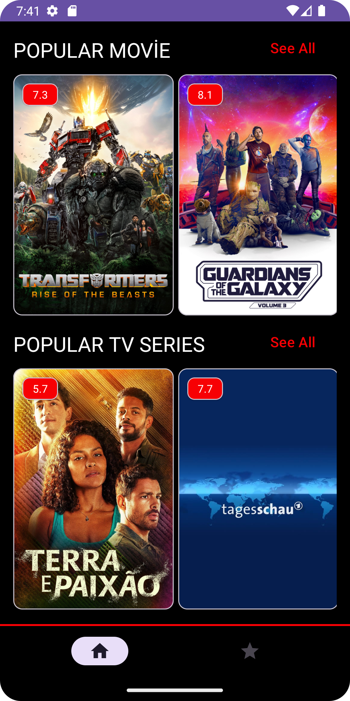
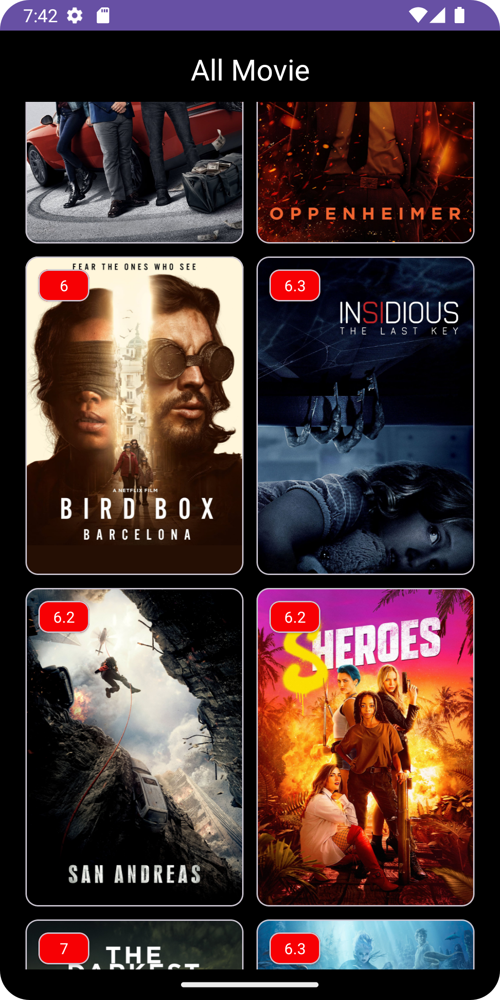
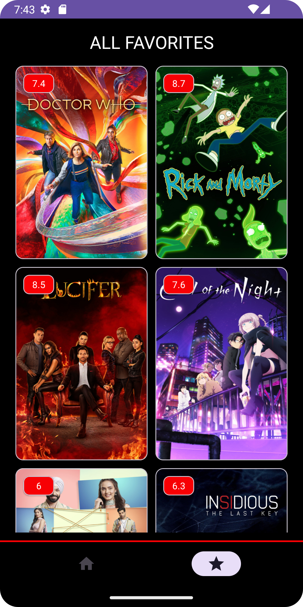
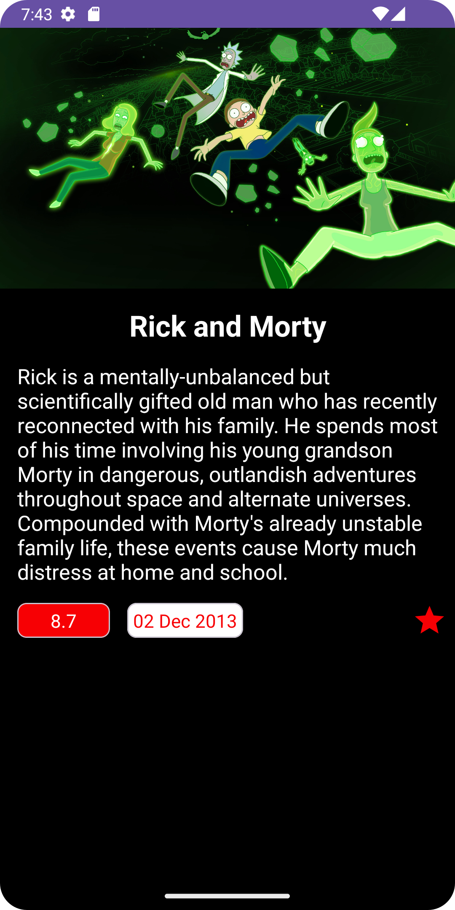

# MovieApp
**The MovieScope app is a application where you can follow the trends of popular movies and TV series, find out more information and add your favorites to your list. Paging 3 support was also added later.
With Paging 3 support, I tried to learn the pagination feature by sending requests to the API twice.** 

[API URL](https://developers.themoviedb.org/3/getting-started/introduction)

**Libraries**
+ MVVM 
+ [Hilt](https://developer.android.com/training/dependency-injection/hilt-android)
+ [Room](https://developer.android.com/training/data-storage/room)
+ [Navigation Component](https://developer.android.com/guide/navigation/get-started) 
+ [ViewModel](https://developer.android.com/topic/libraries/architecture/viewmodel#implement)
+ [Coroutines](https://developer.android.com/kotlin/coroutines)
+ [StateFlow,Flow](https://developer.android.com/kotlin/flow/stateflow-and-sharedflow#livedata)
+ [Repositories](https://developer.android.com/topic/architecture#data-layer)
+ [Firebase Crashlytics](https://firebase.google.com/docs/crashlytics?hl=tr)
  
  ***Third party libraries***
  - [Retrofit](https://square.github.io/retrofit/)
  - [OkHttp](https://square.github.io/okhttp/recipes/)
  - [Gson](https://github.com/google/gson)
  - [Glide](https://github.com/bumptech/glide)
  - [Paging3](https://developer.android.com/topic/libraries/architecture/paging/v3-overview)
  - [Timber](https://github.com/JakeWharton/timber)

## Screens
| Home Screen | All Movie Screen | Alll Tv Series Screen | Favorites Screen | Detailer Screen |
| --- | --- | --- | --- |--- |
|  |  |  |  |  |

